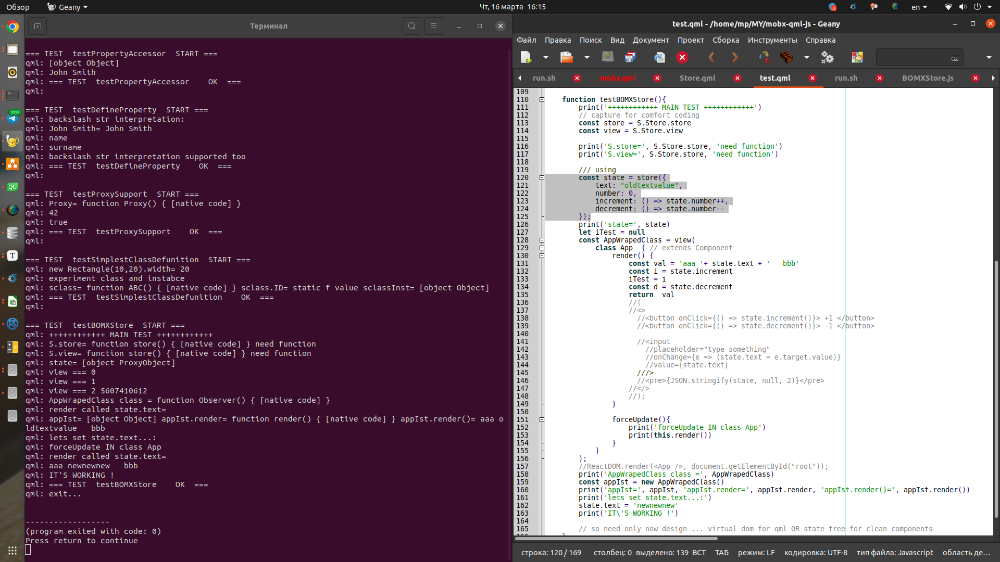

# "Mobx" replacement For Qml (5.12) js

**Problem**: mobx store observable system complex but not ported to qmljs platform (and qmljs loader system are different)

**problem 2**: mobx-react-lite for react but not for qml

**Solution:**  i try "qmlify" it , bot without sucess, .. polyfills... some globals .. dependency .. configuration... 

And i write small replacement with same conception.  

> now it not for production. it is an experiment

